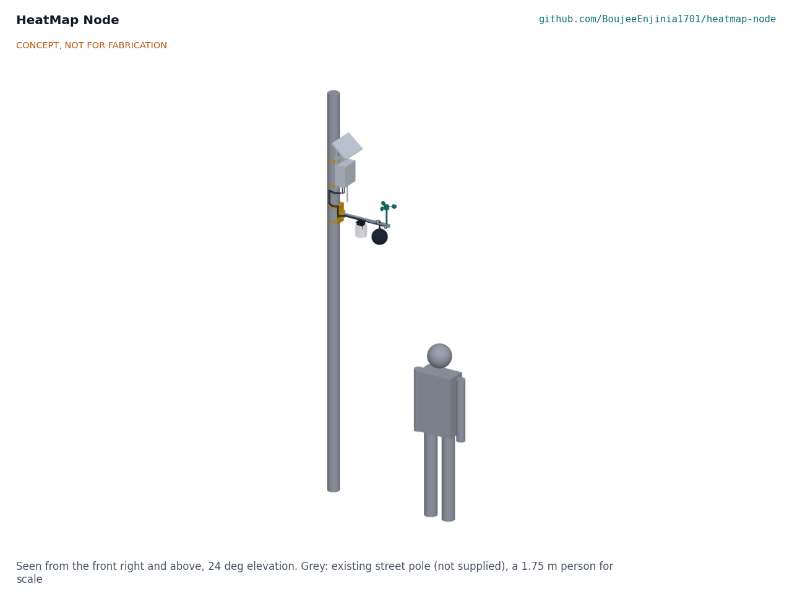
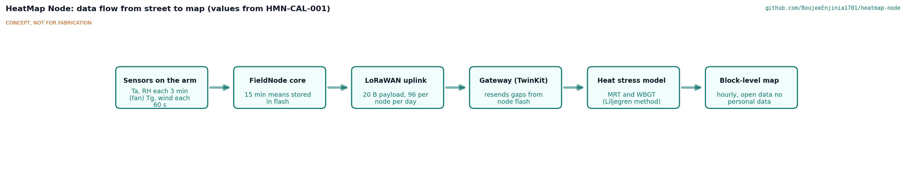
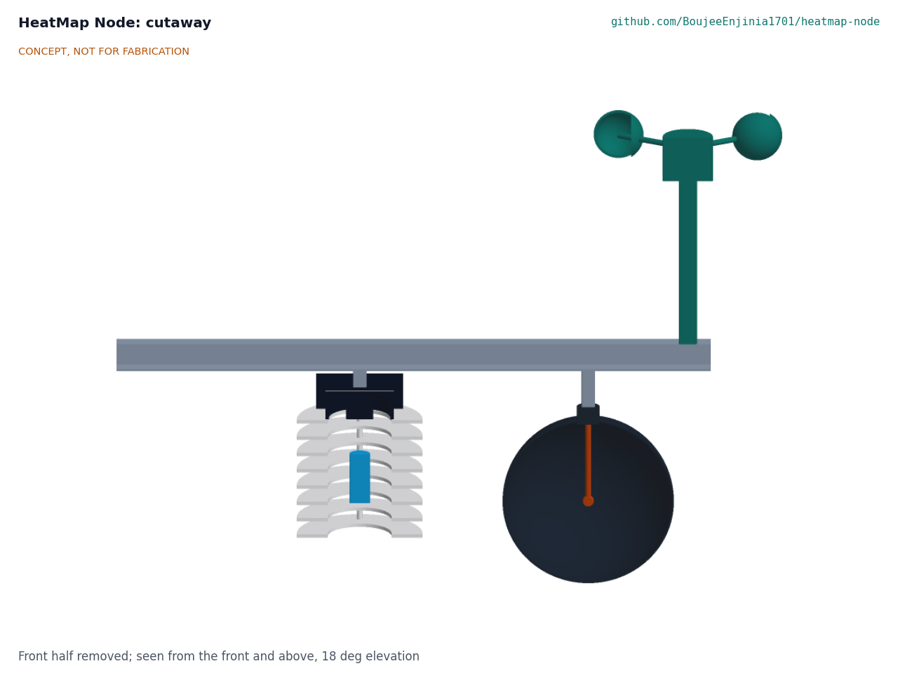
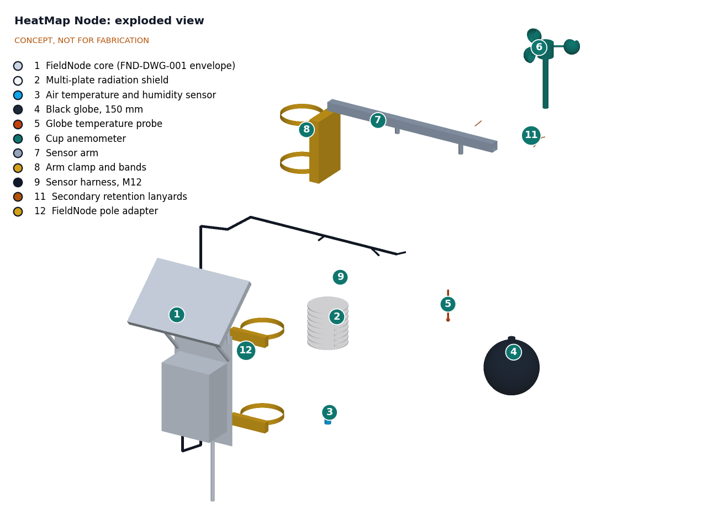

# HeatMap Node design precis

## Summary

HeatMap Node is a sensor head that clamps to an existing street pole and plugs into the lab's FieldNode core. A horizontal arm, pointing toward the equator, holds a fan-aspirated radiation shield with an air temperature and humidity sensor, a standard 150 mm black globe with a thermistor at its center, and a small cup anemometer. From these four readings a server computes mean radiant temperature and an estimated wet bulb globe temperature (WBGT), the heat stress index defined in [ISO 7243:2017](https://www.iso.org/standard/67188.html), using the method of [Liljegren et al. (2008)](https://doi.org/10.1080/15459620802310770). Tens of nodes across a neighborhood give block-by-block heat stress maps, day and night, all season.

The TRL 3 calculations (HMN-CAL-001 v0.4) confirm the heat stress method and the power, data and wind cases. With the decisions Amish accepted on 2026-09-25 (HMN-DDR-001 and HMN-DDR-002) applied, one requirement is not met on paper: the sensors sit at about 2.7 m rather than pedestrian height (R9). The design for construction (HMN-DDR-003) made every part buildable; with the fan and the added fixings the sensor head is estimated at $136, $6 over its $130 value-engineering target (R13). The fan cuts the shield's radiation error from about 1.0 °C at 1 m/s to 0.43 °C at any wind speed, and the sensors and fan draw 35 mW. All design choices below are decided by Amish. The parametric model is `cad/src/model.py`, the general arrangement is drawing HMN-DWG-001 Rev P4, and the prototype build plan is [HMN-BLD-001](05-build-plan.md).

*Figure 1. HeatMap Node on a 114 mm street pole, arm axis at 2.8 m pointing toward the equator, FieldNode core with its sun shield below the arm and facing the same way, with a 1.75 m person for scale. The pole is not supplied. CONCEPT, NOT FOR FABRICATION.*

## How it works

1. **Air temperature and humidity.** A digital sensor sits inside a stack of eight white plates that block direct and reflected sun while letting wind through. Every 3 min a small fan on the top plate runs for 6 s and draws air up past the sensor, which is read at the end of the run, so the reading does not depend on the wind (HMN-DDR-002).
2. **Radiant heat.** A thin copper sphere painted matte black reaches a balance between absorbed sun and long-wave radiation from hot walls and pavement and convective loss to the air. A thermistor at its center reads this globe temperature.
3. **Wind.** A cup anemometer gives the wind speed needed to separate radiant from convective heat at the globe. Below its start-up speed of about 0.8 m/s it reads zero; the node reports the share of each interval spent below start-up, and the server flags MRT and WBGT for any interval where that share is 20 % or more.
4. **Logging and radio.** The FieldNode core samples every 60 s, averages over 15 min, stores the means in flash and sends about 20 bytes by LoRaWAN to a gateway such as TwinKit. Missing packets are resent from flash.
5. **Heat stress and mapping.** A server script computes mean radiant temperature and WBGT and places each node on a block-level map, published as open data. Only environmental values leave the node.

*Figure 2. Data flow from the street to the map. All values are estimates.*

*Figure 3. Section through the sensor arm: temperature and humidity sensor inside the radiation shield, and the thermistor at the center of the globe.*

## Main components

Numbers match the exploded view (Figure 4) and `bom/bom.csv`. Line 10 (hardware) has no callout.

| # | Component | Choice (TRL 3) | Notes |
| --- | --- | --- | --- |
| 1 | FieldNode core | 150 x 90 x 200 mm IP65 enclosure with FieldNode's hot-climate sun shield, 6 W 9 V class panel as sun hood at 40°, 3.2 V 6 Ah LiFePO4 cell, MPPT board, STM32WL-class LoRaWAN module, two M12 ports (FND-DWG-001 Rev P3), built to FND-BLD-001 | Shared lab component, 2.61 kg, $148.00 with the shield (FND-CAL-001 v0.4); below the arm, facing the equator |
| 2 | Radiation shield | Eight 110 mm white plates at 15 mm pitch, printed UV-stable ASA with bosses between them, on four M5 rods; 56 mm hole in the top plate under the fan; hung from the arm on two of the rods | Aspirated by line 13 |
| 3 | Temperature and humidity sensor | SHT45 digital sensor (typical ±0.1 °C, ±1.0 %RH) with PTFE membrane cap | I2C over the M12 port |
| 4 | Black globe | 150 mm copper sphere, about 0.4 mm wall, matte black, hung on a hollow M10 brass tube through the arm | Standard globe size, so published globe equations apply |
| 5 | Globe probe | 10 k NTC bead at the globe center | Calibrated in CalRig |
| 6 | Cup anemometer | Three-cup, pulse output, its mast through the arm tip and pinned | Counted by the FieldNode low-power timer |
| 7 | Sensor arm | 25 mm square aluminium tube, 530 mm | Keeps globe and shield about 250 to 450 mm clear of the pole |
| 8 | Arm clamp | Channel 120 x 180 x 40 mm bent from 3 mm aluminium sheet, with 120° V notches in its flanges lined with rubber trim; two angle cheeks that hold the arm; two 13 mm stainless strap bands for 60 to 200 mm poles | No drilling of the pole |
| 9 | Sensor harness | Two M12 5-pin leads along the pole and arm | Plug-in at both ends |
| 11 | Secondary retention | Two 1.5 mm stainless lanyards, globe boss and shield top to the arm | Added at TRL 3 |
| 12 | FieldNode pole adapter | Two printed 120° V-blocks, fixed by FieldNode's own V-block screws, and strap bands, in place of FieldNode's own V-blocks | Added at TRL 3; FieldNode's kit seats only small poles; counted against FieldNode |
| 13 | Aspiration fan and cowl | 60 x 60 x 15 mm 5 V fan (about 0.9 W) on the top plate under a printed ASA cowl 76 x 76 x 30 mm, exhausting sideways under a solid lid | Added under HMN-DDR-002; 6 s every 3 min from FieldNode's switched 5 V rail |

*Figure 4. Exploded view with callouts matching the BOM.*

The blueprint sheet is in [media/concept-blueprint.pdf](../media/concept-blueprint.pdf) and an interactive model in [media/viewer.html](../media/viewer.html).

## First-order numbers

The TRL 2 estimates below have been checked in HMN-CAL-001, and the figures quoted here are from that note. They remain calculations, not measurements.

### From measurements to heat stress

For a standard globe under forced convection, mean radiant temperature (MRT) follows from globe temperature *T*g, air temperature *T*a, wind speed *v* (m/s), globe diameter *D* (m) and emissivity *ε*:

MRT = [(*T*g + 273)⁴ + 1.1 × 10⁸ *v*^0.6 / (*ε D*^0.4) × (*T*g - *T*a)]^0.25 - 273

This is the forced-convection form of the ISO 7726:1998 method, as implemented in the open [pythermalcomfort](https://pythermalcomfort.readthedocs.io/en/latest/reference/pythermalcomfort.html) library; below about 0.16 m/s in the example natural convection governs and the larger coefficient is used (HMN-CAL-001, section A). Outdoor WBGT is 0.7 *T*nwb + 0.2 *T*g + 0.1 *T*a ([ISO 7243:2017](https://www.iso.org/standard/67188.html)), where the natural wet-bulb temperature *T*nwb is estimated from the same four readings with the Liljegren method ([open implementation](https://github.com/mdljts/wbgt)).

**Worked example (assumptions: 35 °C air, 40 %RH, 50 °C globe, 1 m/s wind, *D* = 0.15 m, *ε* = 0.95).** MRT is 74.8 °C. The psychrometric wet bulb is 24.2 °C; a wick energy balance puts the natural wet bulb in sun at 26.0 °C, so WBGT is 0.7 × 26.0 + 0.2 × 50 + 0.1 × 35 = 31.7 °C (HMN-CAL-001, section B). Air temperature alone (35 °C) says nothing about the sun load that the globe captures.

**Sensitivity.** In the same example, a wind reading of 0.5 m/s instead of 1 m/s lowers MRT to 66.9 °C, and 1.5 m/s raises it to 80.7 °C. A 1 °C air temperature error moves MRT by 1.5 °C. Below the anemometer's start-up speed (about 0.8 m/s) the node reads zero wind, which at a true 0.5 m/s puts MRT 8.2 °C low and WBGT 0.9 °C high. With the fan-aspirated shield the input errors add up to ±0.30 °C of WBGT (±0.59 °C with the passive shield at 1 m/s); air temperature is still the largest term, at 0.43 °C of shield error (HMN-CAL-001, sections B and C).

### Power

The temperature and humidity sensor, read every 3 min at the end of a fan run, takes about 11 µJ per reading and the switched thermistor divider, read every minute, about 8 µJ. The anemometer pulses are counted by a low-power timer; with a 100 kΩ pull-up the worst case (reed contact resting closed) is 0.109 mW. The sensors draw 0.116 mW. The fan (0.9 W for 6 s every 180 s, through an 85 % efficient 5 V rail) adds 35.3 mW, for a total of 35.4 mW, 35 % of the 100 mW design allowance in FND-CAL-001. With the core below the arm and both facing the equator, the shield, globe and arm shade 16 to 44 % of the FieldNode panel near noon (HMN-CAL-001, section E), which this budget does not include; see the review note.

### Radio

At the 15 min default, each node sends 96 uplinks of 20 bytes a day (eleven fields, including the share of each interval below the anemometer's start-up), 23.7 s/day of airtime at SF9 (FND-CAL-001). Seven days of records at FieldNode's 32 B each take 21.5 kB of its 16 MB flash.

### Wind load and mass

At a 35 m/s gust (750 Pa) the sensor head carries 46.5 N (globe 6.6 N, shield 10.7 N, fan cowl 2.1 N, anemometer 7.2 N, arm 19.9 N) and the FieldNode core with its sun shield 88 N (FND-CAL-001 v0.2). The arm root sees 14.6 N·m and 11.1 MPa, a factor of 13.0 on yield; the tip deflects 0.31 mm at 20 m/s. The clamp's band friction resists the twist with a factor of 2.5 at the assumed 1,000 N preload. The node adds about 338 N·m at the pole base, which the pole owner should check.

The sensor head weighs 2.12 kg (clamp 0.44 kg, globe with its hanger 0.35 kg, shield 0.32 kg, anemometer 0.31 kg, harness 0.27 kg, arm 0.27 kg, fan and cowl 0.08 kg and small parts), within the 4 kg of R15, which now applies to the sensor head. With the FieldNode core and shield (2.61 kg) and the pole adapter (0.22 kg) the complete node weighs 4.95 kg.

### Cost

`budget_usd` is a hypothetical value-engineering target, not a spending limit (Amish, 2026-10-01). Value-engineering target: USD 130 for the sensor head. Estimated cost of the constructable design: USD 136 (USD 6 over the target), from BOM lines 2 to 11 and 13. The FieldNode core with its sun shield ($148.00) and the pole adapter ($8.00) are counted against FieldNode, and the full node costs about $292.00. The fan and cowl added $7 in HMN-DDR-002 and the fixings that make the node buildable a further $9 (HMN-DDR-003); the cost drivers and savings worth trying are in the design decisions register (HMN-DEC-001).

## Key design choices

Decided by Amish, 2026-09-25 (HMN-DDR-001 and HMN-DDR-002).

1. **Build on FieldNode** rather than a separate power and radio design, with a TwinKit gateway or a public LoRaWAN network (D7). Reuses a shared core, costed in its own repo (D1), fitted with FieldNode's hot-climate sun shield so that it stays within its rating at +50 °C.
2. **Standard 150 mm globe** rather than a 38 to 40 mm table tennis ball globe. The standard size matches published globe equations and the Liljegren model; the small globe is cheaper and faster to respond but more sensitive to wind and less comparable.
3. **Derived WBGT** rather than a wetted natural wet-bulb sensor, which needs a water reservoir and wick care at every node.
4. **Fit a cup anemometer** rather than use wind from the nearest official station, because street wind differs strongly from airport wind and MRT is sensitive to it. Its range starts at about 0.8 m/s, and calm intervals are flagged rather than corrected.
5. **Fan-aspirated shield**, run 6 s before each reading every 3 min, rather than a naturally ventilated shield, which reads about 1 °C high in full sun at 1 m/s. The fan adds 35 mW, a wear part and $7.
6. **Arm at about 2.8 m** to deter tampering (D2), with a correction to pedestrian height (HMN-CAL-001 estimates 0.2 to 0.8 °C in strong sun) and a later pilot comparing 2.0 and 2.8 m (TRL 4, on hold), rather than at 1.5 to 2 m where the data is most representative (R9 not met).
7. **Arm toward the equator**, with the FieldNode core below it, so the pole does not shade the globe near midday. HMN-CAL-001 finds that the sensor head then shades part of the FieldNode panel. Amish decided on 2026-10-02 to mount the FieldNode core above the arm, provided its lid stays reachable from the ladder or lift used to fit the arm, and otherwise on the pole's east or west face (HMN-DEC-001); the model and build plan still show the core below the arm.
8. **Open data, environmental channels only** (R12, D8). The data go through a TwinKit gateway and are published from CityTwin's open data export under an open licence, with Amish's lab as publisher until the partner city takes it over (decided 2026-10-02, HMN-DEC-001).

## Safety

> **Safety:** Mounting on street poles is work at height next to traffic. Install only with the pole owner's written permission, by trained crews, with a stable ladder or lift, fall protection and traffic management as local rules require, and keep clear of overhead power lines and any live parts of lighting poles. Check that the pole can carry the added wind load.
>
> **Safety:** The FieldNode core contains a LiFePO4 cell of about 19 Wh. Fuse it at the holder, charge only within the maker's temperature limits, and do not install a swollen, damaged or wet cell.
>
> **Safety:** The globe and the shield hang from the arm on fixings backed by stainless lanyards, so a failed fixing does not drop a part onto the street. Check the fixings and lanyards at every visit.
>
> **Safety:** The black globe can reach about 67 °C at 50 °C air in full sun (HMN-CAL-001), and the arm runs hot too. Let them cool or wear gloves before handling. Cut edges on the aluminium arm, formed saddle and copper sphere must be deburred. The anemometer cups spin and the shield fan starts on its own every 3 min; stop the cups and unplug the sensor lead before working near them.
>
> **Safety:** HeatMap Node data is for planning and research. It is not an official heat warning, and it must not be used to decide whether a particular person is safe to work or exercise without the responsible agency's guidance.

## Open questions

- [x] Budget: `budget_usd` ($130) is a value-engineering target; the constructable sensor head is estimated at $136.
- [x] Panel shading: the sensor head shades 16 to 44 % of the FieldNode panel near noon with the arm toward the equator; where should the core go? Decided 2026-10-02: above the arm if its lid stays reachable, otherwise on the pole's east or west face (HMN-DEC-001).
- [ ] Mounting height: what do pole owners allow? The calculated difference (0.2 to 0.8 °C) needs a field comparison.
- [ ] Fan: does a chosen 60 mm fan deliver the 3.4 L/s through the stack that ±0.5 °C needs, and how long does it last outdoors?
- [ ] Globe response: HMN-CAL-001 estimates about 12 min to 90 %, faster than the TRL 2 estimate; a step test is needed.
- [ ] How often must nodes be recalibrated in CalRig, and how are dust and fading of the black paint handled?
- [x] Data model and hosting: TwinKit, CityTwin or a public platform, and who publishes it? Decided 2026-10-02: through a TwinKit gateway, published from CityTwin's open data export under an open licence, with Amish's lab as publisher until the partner city takes it over, and mirrored on the city's own open data portal if it has one (HMN-DEC-001).
- [ ] Night-time value: are 15 min means enough to capture nights that do not cool, when the body cannot recover from daytime heat?
